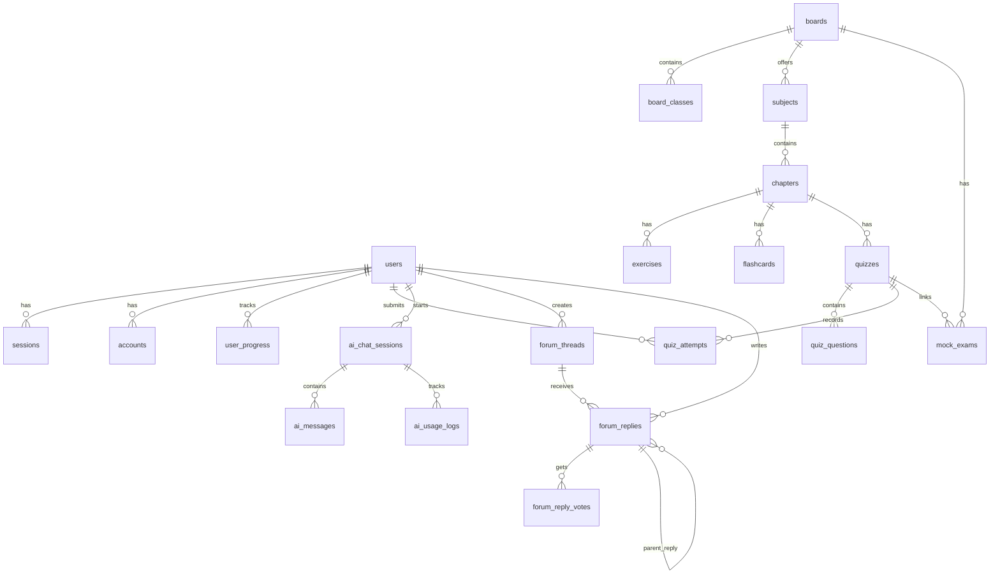

The LearningoPK database uses **PostgreSQL 16** with **Drizzle ORM** for type-safe queries and migrations. The schema is defined in `backend/src/lib/db/schema.ts` and consists of 28 tables with 18 custom PostgreSQL enums.

<Note>
  PostgreSQL is exposed on host port **5433** (mapped from container port 5432) to avoid conflicts with local PostgreSQL installations. Connections go through **PgBouncer** on port 6432 in transaction pooling mode.
</Note>

## Entity relationship diagram



## Tables by domain

### Authentication (Better Auth)

These tables are managed by **Better Auth** — do not create or modify them manually.

| Table | Primary key | Description |
|-------|-------------|-------------|
| `user` | `text` (id) | User accounts with role (student/admin), XP, level, streak, and suspension fields |
| `session` | `text` (id) | Active sessions with tokens, IP address, and user agent |
| `account` | `text` (id) | Linked auth accounts (email/password, OAuth providers) with access/refresh tokens |
| `verification` | `text` (id) | Email verification and password reset tokens |

<Accordion title="User table columns">
  | Column | Type | Notes |
  |--------|------|-------|
  | `id` | text (PK) | Better Auth generated |
  | `name` | text | Display name |
  | `email` | text (unique) | Login email |
  | `email_verified` | boolean | Verification status |
  | `image` | text | Avatar URL |
  | `student_class` | text | Student's class |
  | `degree` | text | Degree information |
  | `board` | text | Education board |
  | `role` | enum: student, admin | User role |
  | `status` | enum: active, suspended | Account status |
  | `xp` | integer | Experience points (default 0) |
  | `level` | integer | Gamification level (default 0) |
  | `streak_freeze_used_at` | timestamp | Last streak freeze usage |
  | `suspended_at` | timestamp | Suspension timestamp |
  | `suspended_reason` | text | Reason for suspension |
  | `suspended_by` | text (FK → user) | Admin who suspended |
</Accordion>

### Curriculum hierarchy

The curriculum follows a **Board → Class/Grade → Subject → Chapter** hierarchy.

| Table | Primary key | Description |
|-------|-------------|-------------|
| `boards` | `serial` | Education boards (Federal, Punjab, Sindh) with name and slug |
| `board_classes` | `serial` | Classes within a board (linked via `board_id`) |
| `subjects` | `serial` | Subjects per board and grade (9th/10th) with icon and description |
| `chapters` | `serial` | Chapters within subjects, with rich-text summaries and publish status |
| `content_sources` | `uuid` | PDF source tracking (file name, hash, parser version) |
| `chapter_summary_links` | `uuid` | Cross-chapter hyperlinks extracted from summaries |
| `chapter_title_aliases` | `serial` | Alternative chapter titles for search resolution |
| `chapter_summary_media` | `uuid` | Uploaded media files for chapter summaries (stored in MinIO) |

<Accordion title="Chapter linking system">
  Chapters support a wiki-style linking system:

  - **`chapter_summary_links`** — stores hyperlinks found in chapter summaries, with normalized target text and resolution status
  - **`chapter_title_aliases`** — alternative titles that resolve to the same chapter for flexible cross-referencing
  - Both tables use normalized text matching for robust link resolution
</Accordion>

### Content

| Table | Primary key | Description |
|-------|-------------|-------------|
| `exercises` | `serial` | Chapter exercises with questions, step-by-step solutions, difficulty (easy/medium/hard), and type (mcq/short/long/numerical) |
| `flashcards` | `serial` | Term/definition pairs for chapter revision, ordered by `order_index` |

### Assessments

| Table | Primary key | Description |
|-------|-------------|-------------|
| `quizzes` | `serial` | Chapter quizzes and mock exams with duration and total marks |
| `quiz_questions` | `serial` | MCQ questions with 4 options (a/b/c/d), correct answer, explanation, and marks |
| `quiz_attempts` | `uuid` | User submissions with JSONB answers, scores, and timestamps |
| `mock_exams` | `serial` | Board-pattern exams linked to quizzes via `quiz_id` |

<Accordion title="Quiz attempt answer storage">
  Answers are stored as a JSONB column with the shape `Record<string, string>`:

  ```json
  {
    "1": "b",
    "2": "a",
    "3": "d"
  }
  ```

  Keys are question IDs (as strings), values are selected option letters. This avoids a separate join table while keeping queries simple.
</Accordion>

### AI tutor

| Table | Primary key | Description |
|-------|-------------|-------------|
| `ai_chat_sessions` | `uuid` | Conversation sessions linked to user and optionally a chapter |
| `ai_messages` | `uuid` | Individual messages (role: user/assistant) within a session |
| `ai_usage_logs` | `uuid` | Token usage tracking per session (prompt_tokens, completion_tokens) |

### Community forum

| Table | Primary key | Description |
|-------|-------------|-------------|
| `forum_threads` | `uuid` | Discussion threads linked to subjects/chapters, with pin/solve flags and view count |
| `forum_replies` | `uuid` | Threaded replies with `parent_reply_id` self-reference, accepted answer flag, and upvotes |
| `forum_reply_votes` | `uuid` | Per-user vote records (upvote/downvote) on replies |

<Note>
  The `forum_threads` table has a **GIN full-text search index** on `title` and `body` columns for efficient text search.
</Note>

### Progress tracking

| Table | Primary key | Description |
|-------|-------------|-------------|
| `user_progress` | `serial` | Per-user, per-chapter progress with unique constraint on `(user_id, chapter_id)` |

Tracked metrics per chapter:
- `visited_at` — last access timestamp
- `exercises_viewed` — number of exercises reviewed
- `flashcards_completed` — boolean completion flag
- `quiz_best_score` — highest quiz score achieved
- `quiz_attempts_count` — total quiz attempts

### Administration

| Table | Primary key | Description |
|-------|-------------|-------------|
| `moderation_flags` | `uuid` | Content flags for threads, replies, or chapters with resolution tracking |
| `admin_audit_logs` | `uuid` | Audit trail of admin actions across content, forum, moderation, and users |
| `admin_notifications` | `uuid` | Platform notifications with audience targeting (all/students/admins) |
| `admin_settings` | `text` (key) | Key-value platform configuration |

### Other

| Table | Primary key | Description |
|-------|-------------|-------------|
| `institutes` | `serial` | Educational institute records |

## Enums

The schema defines 18 PostgreSQL enums for type-safe constrained values:

| Enum | Values |
|------|--------|
| `user_role` | student, admin |
| `grade` | 9, 10 |
| `difficulty` | easy, medium, hard |
| `exercise_type` | mcq, short, long, numerical |
| `quiz_type` | chapter_quiz, mock_exam |
| `answer_option` | a, b, c, d |
| `ai_message_role` | user, assistant |
| `vote_type` | upvote, downvote |
| `user_status` | active, suspended |
| `moderation_target_type` | thread, reply, chapter |
| `moderation_status` | open, resolved |
| `admin_audit_scope` | content, forum, moderation, notifications, settings, users |
| `admin_audit_status` | success, failed |
| `notification_audience` | all, students, admins |
| `notification_status` | sent |

## Key indexes

Beyond primary keys and foreign keys, these indexes optimize common queries:

| Index | Table | Columns | Type |
|-------|-------|---------|------|
| `subjects_board_grade_slug_idx` | subjects | board_id, grade, slug | unique |
| `chapters_subject_slug_idx` | chapters | subject_id, slug | unique |
| `exercises_chapter_exercise_number_idx` | exercises | chapter_id, exercise_number | unique |
| `user_progress_user_chapter_idx` | user_progress | user_id, chapter_id | unique |
| `forum_threads_search_idx` | forum_threads | title + body | GIN (full-text) |
| `forum_reply_votes_user_reply_idx` | forum_reply_votes | user_id, reply_id | unique |
| `account_provider_account_idx` | account | provider_id, account_id | unique |

## Migration workflow

```bash
# 1. Modify schema in backend/src/lib/db/schema.ts
# 2. Generate migration
pnpm db:generate

# 3. Apply migration
pnpm db:migrate

# 4. Or push schema directly (dev only)
pnpm db:push
```

Migration files are stored in `backend/drizzle/` and tracked in version control.

<Tip>
  Use `pnpm db:studio` to open **Drizzle Studio**, a visual database browser for inspecting data during development.
</Tip>
