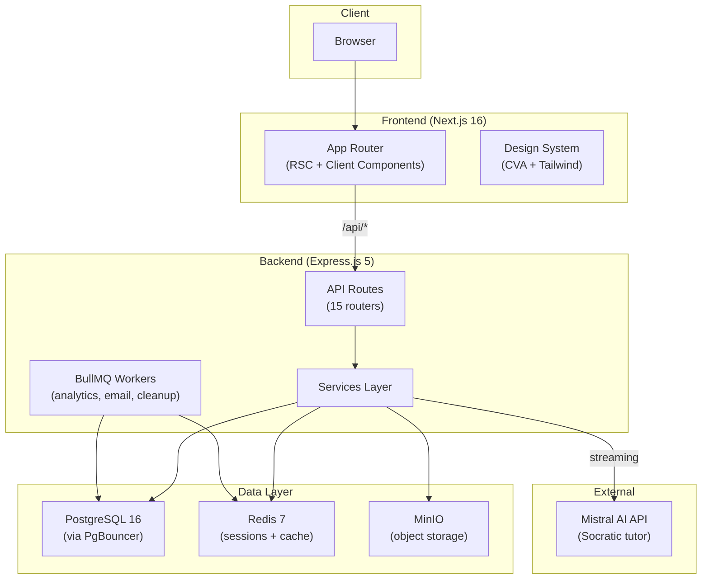

LearningoPK uses a **split architecture** with a Next.js frontend and an Express.js backend, connected through a REST API layer. All infrastructure runs locally via Docker Compose for zero-cost investor demos and development.

## Architecture diagram



## Request flow

A typical request follows this path through the system:

<Steps>
  <Step title="Browser request">
    The student's browser loads a page through Next.js App Router, which uses React Server Components (RSC) for initial data fetching and Client Components for interactive features.
  </Step>
  <Step title="Frontend to backend">
    Client components call the Express.js backend via `/api/*` endpoints. CORS is configured to accept requests from the frontend origin with credentials (HTTP-only cookies).
  </Step>
  <Step title="Backend processing">
    Express routes delegate to service functions, which use Drizzle ORM to query PostgreSQL through a PgBouncer connection pool. Redis handles session caching and rate limiting.
  </Step>
  <Step title="AI streaming">
    For AI tutor conversations, the backend streams responses from Mistral AI using the Vercel AI SDK's `streamText`, delivering real-time Socratic dialogue to the frontend's `useChat` hook.
  </Step>
</Steps>

## Key architectural decisions

<AccordionGroup>
  <Accordion title="Separate backend — not Next.js route handlers">
    The Express.js backend is a standalone application, not embedded in Next.js. This keeps the Mistral API key server-side, allows independent scaling, and separates concerns cleanly. The frontend at `frontend/` and backend at `backend/` are connected only through HTTP.
  </Accordion>

  <Accordion title="App Router only — no Pages Router">
    The frontend uses Next.js 16 App Router exclusively. Server Components handle data fetching where possible, reducing client-side JavaScript. Interactive features (chat, quizzes) use Client Components with `"use client"` directives.
  </Accordion>

  <Accordion title="Streaming AI responses">
    AI tutor conversations use the Vercel AI SDK for real-time streaming. The backend calls `streamText` with the Mistral provider, and the frontend renders tokens as they arrive via `useChat`. This creates a natural conversational feel for the Socratic teaching method.
  </Accordion>

  <Accordion title="PDF seeding as a CLI script">
    Chapter content is extracted from board-specific PDFs using a one-time CLI seed script (`pnpm db:seed`). Extracted text is stored in PostgreSQL — no binary PDF storage or external file service is needed.
  </Accordion>

  <Accordion title="Connection pooling via PgBouncer">
    PostgreSQL connections go through PgBouncer in transaction pooling mode. This supports up to 500 client connections with a default pool size of 25, preventing connection exhaustion under load.
  </Accordion>
</AccordionGroup>

## Source code organization

The monorepo uses pnpm workspaces with two main packages:

<CodeGroup>
```text backend/src/
├── routes/          # 22 Express routers (admin, ai-chat, ai-context, auth, forum, notes, formulas, etc.)
├── services/        # Business logic
├── repositories/    # Database queries via Drizzle
├── lib/             # Core utilities (auth, db, redis, minio, env, etc.)
├── middleware/       # Express middleware
├── workers/         # BullMQ background workers
└── tests/           # Unit and integration tests
```

```text frontend/
├── app/             # Next.js App Router pages
│   ├── (auth)/      # Authentication pages
│   ├── (dashboard)/ # Student dashboard, subjects, stats, calendar, settings
│   ├── (learn)/     # Learning pages: [board]/[grade]/[subject], past-papers
│   ├── admin/       # Admin panel (17 sections)
│   ├── ai-tutor/    # AI chat interface
│   └── forum/       # Community forum
├── src/
│   ├── components/  # 180+ components across ui, admin, learn, forum, stats, etc.
│   ├── design-system/ # Legacy (deprecated, re-exports ui/)
│   └── lib/         # 19 utility functions
└── tests/e2e/       # 25 Playwright E2E specs
```
</CodeGroup>

## Infrastructure services

All services run locally via Docker Compose (`docker-compose.yml`):

| Service | Image | Port | Purpose |
|---------|-------|------|---------|
| PostgreSQL | `postgres:16` | 5433 | Primary database |
| PgBouncer | `edoburu/pgbouncer` | 6432 | Connection pooling (transaction mode) |
| Redis | `redis:7-alpine` | 6379 | Session cache, rate limiting, job queues |
| MinIO | `minio/minio` | 9000 / 9001 | Object storage (S3-compatible) |
| Nginx | `nginx:alpine` | 80 | Reverse proxy + load balancing |
| Backend | Custom Dockerfile | 3001 | Express.js API server |

<Note>
  PostgreSQL is mapped to host port **5433** (not the default 5432) to avoid conflicts with local PostgreSQL installations.
</Note>

## Authentication flow

Authentication is handled by **Better Auth** in the backend:

1. User submits email/password or OAuth credentials
2. Better Auth validates credentials and creates a session
3. An HTTP-only cookie is set on the response
4. Subsequent requests include the cookie automatically
5. Backend middleware verifies the session token against Redis/PostgreSQL

<Warning>
  The `BETTER_AUTH_SECRET` and `FRONTEND_ORIGIN` environment variables must match between backend and frontend. A mismatch causes CORS errors and failed authentication.
</Warning>
