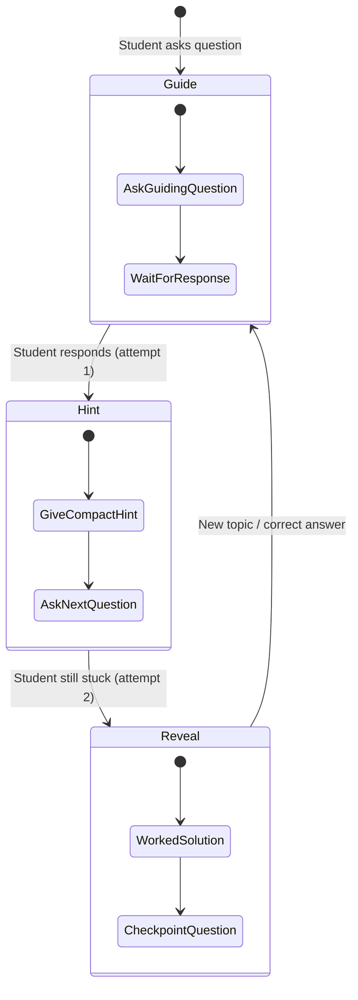
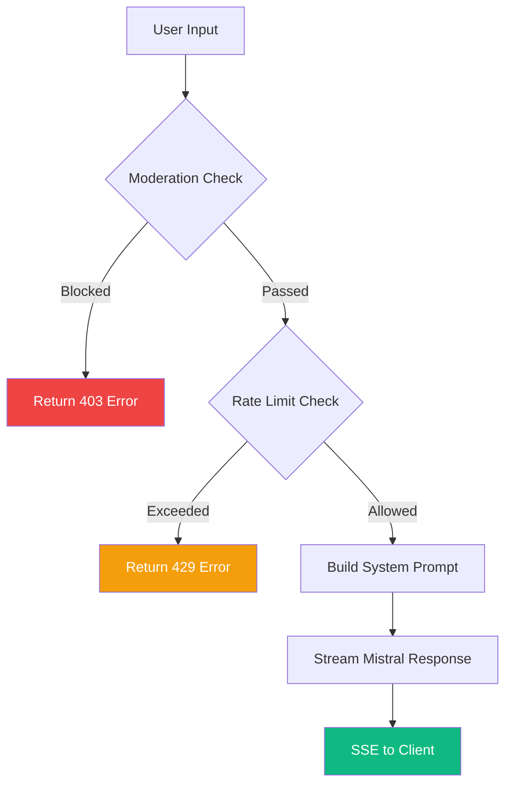
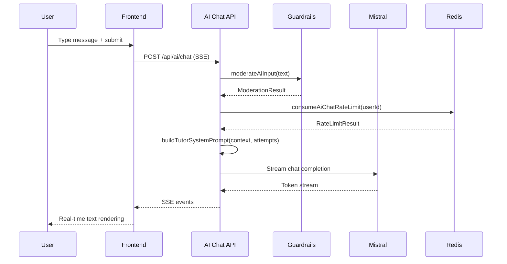

## Overview

The AI Tutor is a conversational learning assistant that uses the **Socratic method** to guide students through problems rather than giving direct answers. Powered by Mistral AI (`mistral-small-latest`), it adapts its response strategy based on how many times a student has attempted a question, progressively revealing more information until the student understands.

<CardGroup cols={3}>
  <Card title="Socratic Method" icon="comments">
    Guides through questions, not answers
  </Card>
  <Card title="Streaming Responses" icon="bolt">
    Real-time SSE streaming for instant feedback
  </Card>
  <Card title="Content Safety" icon="shield">
    Rate limiting and moderation guardrails
  </Card>
</CardGroup>

---

## Mistral AI Integration

The backend uses the Vercel AI SDK's Mistral provider:

```typescript
// backend/src/lib/mistral.ts
import { createMistral } from "@ai-sdk/mistral";

const mistralProvider = createMistral({
  apiKey: env.MISTRAL_API_KEY
});

export const mistralModel = mistralProvider(MISTRAL_MODEL_ID);
```

| Parameter | Value | Purpose |
|-----------|-------|---------|
| Model ID | `mistral-small-latest` | Cost-efficient model for tutoring |
| Max Tokens | `500` | Keeps responses concise for students |
| Temperature | `0.7` | Balanced creativity for natural conversation |

---

## Socratic Method — Controlled Reveal Policy

The tutor adapts its behavior based on how many times the student has responded. This prevents frustration from giving too little help, while preserving the learning value of struggle.

### Three Response Stages

```typescript
export type TutorResponseStage = "guide" | "hint" | "reveal";

const stageInstructions: Record<TutorResponseStage, string> = {
  guide:
    "STAGE: GUIDE QUESTION. Ask one focused guiding question first.",
  hint:
    "STAGE: STRUCTURED HINT. Give a compact hint, then ask the next guiding question.",
  reveal:
    "STAGE: CONCISE REVEAL. Provide a brief worked solution, then ask a checkpoint question."
};
```

### Stage Transition Logic

The system infers the student's struggle level from the conversation history by counting user turns:

```typescript
export const inferFailedAttempts = (messages: ChatMessage[]): number => {
  const userTurns = messages.reduce(
    (count, msg) => (msg.role === "user" ? count + 1 : count), 0
  );
  if (userTurns <= 1) return 0;   // First question → guide
  if (userTurns === 2) return 1;  // Second turn → hint
  return 2;                        // Third+ turn → reveal
};

export const getTutorResponseStage = (failedAttempts: number): TutorResponseStage => {
  if (failedAttempts >= 2) return "reveal";
  if (failedAttempts === 1) return "hint";
  return "guide";
};
```

### Stage Progression Diagram



---

## System Prompt Construction

The system prompt is built dynamically from chapter context and the current response stage:

```typescript
export const buildTutorSystemPrompt = (params: {
  context: TutorChapterContext;
  failedAttempts: number;
}): string => {
  const { context, failedAttempts } = params;
  const stage = getTutorResponseStage(failedAttempts);

  return [
    "You are an AI tutor for Pakistani 9th/10th grade students.",
    "Use the Socratic method with controlled reveal policy.",
    "",
    "Core rules:",
    "- Keep responses concise: 3-5 sentences max.",
    "- Use simple English for a 14-16 year old student.",
    "- Be warm, patient, encouraging, and precise.",
    "",
    "Controlled reveal policy:",
    "- Attempt 0: guiding question.",
    "- Attempt 1: structured hint, then a guiding question.",
    "- Attempt 2+: concise worked solution, then a checkpoint question.",
    "",
    `Current stage rule: ${stageInstructions[stage]}`,
    "",
    "Chapter context:",
    `- board=${context.board}`,
    `- grade=${context.grade}`,
    `- subject=${context.subject}`,
    `- chapter=${context.chapterTitle}`,
    context.focusExerciseQuestion
      ? `- focus_exercise=${context.focusExerciseQuestion}`
      : "- focus_exercise=none"
  ].join("\n");
};
```

The `TutorChapterContext` type provides the AI with curriculum-specific information:

```typescript
export type TutorChapterContext = {
  board: string;
  grade: "9" | "10";
  subject: string;
  chapterTitle: string;
  chapterSummary: string;
  focusExerciseQuestion?: string;
};
```

<Note>
The `focusExerciseQuestion` field allows the tutor to zero in on a specific exercise when the student clicks "Ask AI" from an exercise view. This provides targeted help rather than general chapter discussion.
</Note>

---

## Content Safety Guardrails

The AI tutor implements two layers of protection: **rate limiting** and **content moderation**.

### Rate Limiting

Rate limits are enforced via Redis with a sliding window approach:

```typescript
// backend/src/lib/ai-guardrails.ts
export const AI_CHAT_RATE_LIMIT_MAX_REQUESTS = 20;
export const AI_CHAT_RATE_LIMIT_WINDOW_SECONDS = 60 * 60; // 1 hour
```

Each user gets 20 AI chat requests per hour. The implementation uses Redis key increment with TTL:

```typescript
const consumeRateLimit = async (
  keyPrefix: string,
  userId: string,
  maxRequests: number,
  windowSeconds: number
): Promise<RateLimitResult> => {
  const windowBucket = Math.floor(Date.now() / (windowSeconds * 1000));
  const key = `${keyPrefix}:${userId}:${windowBucket}`;
  const count = await redis.incr(key);

  if (count === 1) {
    await redis.expire(key, windowSeconds);
  }

  return {
    allowed: count <= maxRequests,
    remaining: Math.max(0, maxRequests - count),
    resetSeconds: ttl
  };
};
```

### Content Moderation

User input is checked against regex patterns before being sent to the AI:

```typescript
const profanityPattern = /\b(fuck|fucking|shit|bitch|bastard|asshole|motherfucker)\b/i;
const harassmentPattern = /\b(stupid|idiot|moron|loser|shut up|hate you)\b/i;
const selfHarmPattern = /\b(suicide|kill myself|self harm|hurt myself|want to die)\b/i;
```

The moderation pipeline checks four categories:

| Category | Detection Method | Action |
|----------|-----------------|--------|
| Profanity | Regex word boundary match | Block with `profanity` reason |
| Harassment | Regex word boundary match | Block with `harassment` reason |
| Self-harm | Regex pattern match | Block with `self_harm` reason |
| Spam | Token uniqueness ratio + repetition patterns | Block with `spam` reason |

<Accordion title="Spam detection algorithm">
The spam detector uses multiple heuristics:

```typescript
const detectSpam = (value: string): boolean => {
  // 1. Repeated word detection (same word 8+ times)
  if (repeatedWordPattern.test(sanitized)) return true;

  // 2. Repeated character detection (same char 11+ times)
  if (repeatedCharacterPattern.test(sanitized)) return true;

  // 3. Multiple URL detection (3+ URLs)
  if ((urls?.length ?? 0) >= 3) return true;

  // 4. Low token diversity (for messages 12+ words)
  const uniqueTokenCount = new Set(tokens).size;
  return uniqueTokenCount <= Math.max(3, Math.floor(tokens.length / 5));
};
```
</Accordion>

### Moderation Data Flow



<Warning>
Self-harm detection triggers a block, but the system should also display crisis resources. Currently the moderation returns the reason — the frontend should handle `self_harm` blocks with appropriate helpline information for Pakistani students.
</Warning>

---

## Forum Mutation Rate Limiting

The same guardrails module also protects forum endpoints with higher limits:

```typescript
export const FORUM_MUTATION_RATE_LIMIT_MAX_REQUESTS = 60;
export const FORUM_MUTATION_RATE_LIMIT_WINDOW_SECONDS = 60 * 60; // 1 hour
```

| Endpoint Type | Max Requests/Hour | Window |
|---------------|-------------------|--------|
| AI Chat | 20 | 1 hour |
| Forum Mutations | 60 | 1 hour |

---

## LaTeX to Speech

The platform includes a LaTeX-to-speech converter for accessibility, enabling screen readers and text-to-speech to vocalize mathematical expressions.

### Supported Conversions

```typescript
// Greek letters
"\\alpha" → "alpha", "\\beta" → "beta", "\\gamma" → "gamma"

// Fractions
"\\frac{a}{b}" → "a over b"

// Superscripts
"x^2" → "x squared", "x^3" → "x cubed", "x^n" → "x to the n"

// Trigonometry
"\\sin" → "sine", "\\cos" → "cosine", "\\tan" → "tangent"

// Calculus
"\\int_{a}^{b}" → "integral from a to b"
"\\sum_{i=1}^{n}" → "sum from i=1 to n"
"\\sqrt{x}" → "square root of x"
```

The `latexToSpokenForm` function handles the conversion:

```typescript
export function latexToSpokenForm(latex: string): string {
  const cleaned = latex
    .replace(/\\\((.*?)\\\)/, "$1")
    .replace(/\\\[(.*?)\\\]/, "$1")
    .trim();
  return parseLatexTokens(cleaned);
}
```

The `isComplexEquation` helper detects equations that need enhanced accessibility treatment:

```typescript
const complexCommands = [
  "\\frac", "\\sqrt", "\\sum", "\\int", "\\prod",
  "\\lim", "\\log", "\\ln", "\\sin", "\\cos", "\\tan"
];

function isComplexEquation(latex: string): boolean {
  return complexCommands.some((cmd) => latex.includes(cmd));
}
```

<Tip>
Use `generateEquationDescription(latex)` for human-readable equation labels like "Fraction: a over b" or "Square root of x plus y".
</Tip>

---

## Request Lifecycle

The complete AI chat request lifecycle from user input to streamed response:


