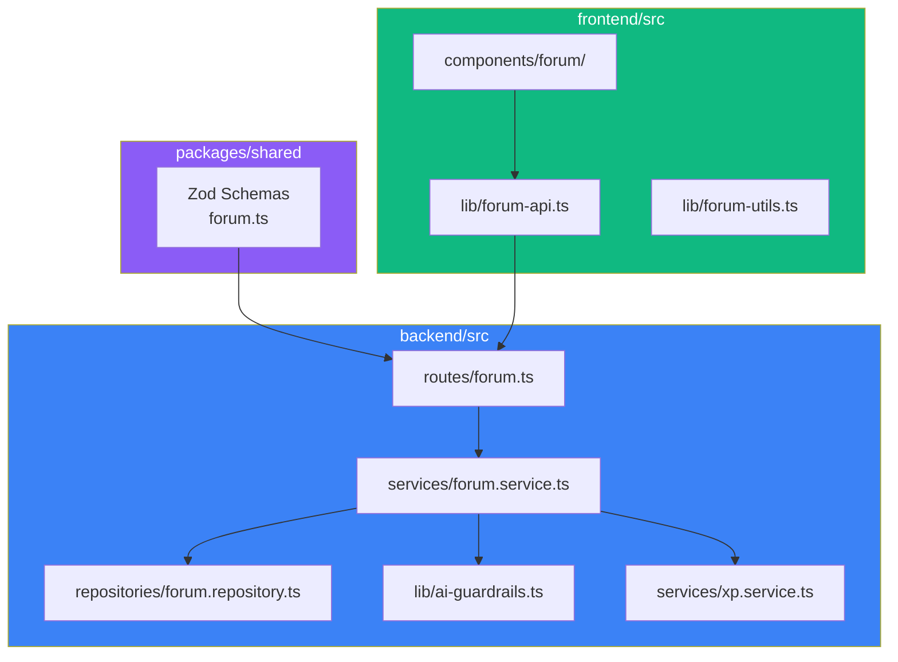
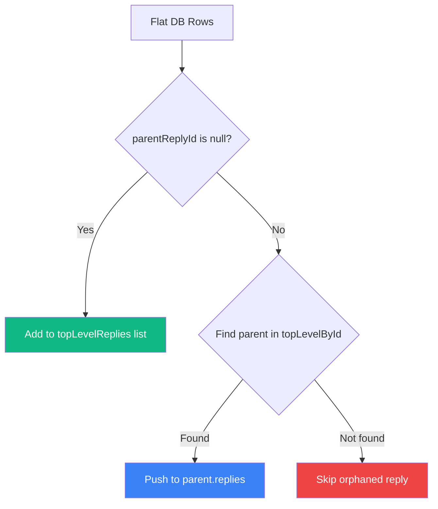
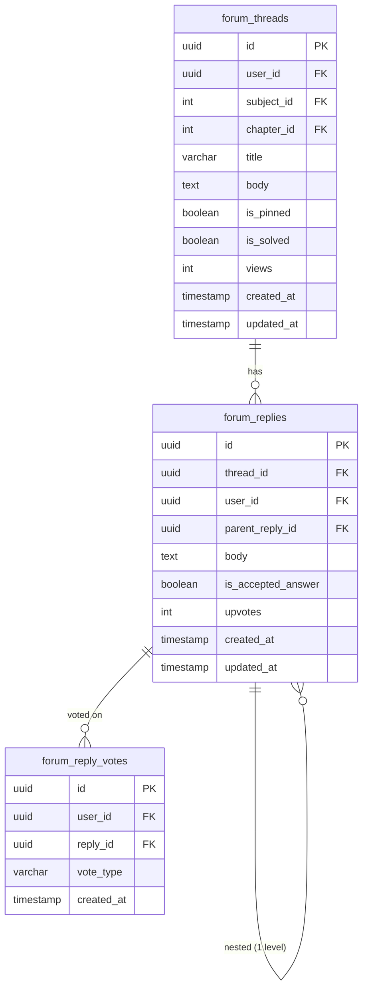

## Overview

The forum enables students to ask questions and help each other within the context of specific subjects and chapters. It follows a **thread-reply model** with one level of nesting, upvote/downvote voting, accepted answers that mark threads as solved, and content moderation with rate limiting.

The architecture separates concerns into three layers: Zod validation schemas (shared), a service layer (business logic), and a repository layer (database queries).

<CardGroup cols={2}>
  <Card title="Threaded Discussions" icon="comments">
    One-level nested replies with parent-child relationships
  </Card>
  <Card title="Voting System" icon="arrow-up-arrow-down">
    Upvote/downvote with toggle and double-delta switching
  </Card>
  <Card title="Accepted Answers" icon="check-circle">
    Thread authors mark solutions, awarding XP to the answerer
  </Card>
  <Card title="Full-text Search" icon="magnifying-glass">
    PostgreSQL `tsvector`-based search with relevance ranking
  </Card>
</CardGroup>

---

## Architecture



---

## Data Validation

All forum inputs are validated with Zod schemas defined in the shared package:

```typescript
// packages/shared/src/types/forum.ts
export const createThreadSchema = z.object({
  title: z.string().trim().min(5).max(160),
  body: z.string().trim().min(10),
  subjectId: z.number().int().positive().optional(),
  chapterId: z.number().int().positive().optional()
});

export const replySchema = z.object({
  body: z.string().trim().min(2),
  parentReplyId: z.string().uuid().optional()
});

export const replyVoteSchema = z.object({
  voteType: z.enum(["upvote", "downvote"])
});

export const threadFeedQuerySchema = z.object({
  board: z.string().trim().regex(/^[a-z0-9-]+$/).optional(),
  grade: z.string().trim().regex(/^[a-z0-9-]+$/).optional(),
  subjectId: z.coerce.number().int().positive().optional(),
  chapterId: z.coerce.number().int().positive().optional(),
  q: z.string().trim().min(1).max(160).optional(),
  solved: z.enum(["all", "solved", "unsolved"]).optional().default("all"),
  limit: z.coerce.number().int().min(1).max(100).optional().default(20),
  offset: z.coerce.number().int().min(0).optional().default(0)
});
```

| Constraint | Value | Purpose |
|------------|-------|---------|
| Title min length | 5 | Prevent empty/low-effort titles |
| Title max length | 160 | Keep thread cards scannable |
| Body min length | 10 | Require meaningful content |
| Reply body min length | 2 | Allow brief responses |
| Search query max length | 160 | Prevent query injection |
| Feed page max size | 100 | Prevent excessive data loads |

---

## Thread Feed & Filtering

The feed supports multi-dimensional filtering with PostgreSQL full-text search.

### Filter Construction

```typescript
buildFilters(filters: ThreadFeedFilters): SQL | undefined {
  const clauses: SQL[] = [];

  if (filters.board)    clauses.push(eq(boards.slug, filters.board));
  if (filters.grade)    clauses.push(sql`coalesce(...) = ${filters.grade}`);
  if (filters.subjectId) clauses.push(eq(forumThreads.subjectId, filters.subjectId));
  if (filters.chapterId) clauses.push(eq(forumThreads.chapterId, filters.chapterId));

  // Full-text search with tsvector
  if (filters.q) {
    clauses.push(
      sql`to_tsvector('english', coalesce(${forumThreads.title}, '') || ' ' || coalesce(${forumThreads.body}, ''))
          @@ plainto_tsquery('english', ${filters.q})`
    );
  }

  // Solved filter
  if (filters.solved === "solved")   clauses.push(eq(forumThreads.isSolved, true));
  if (filters.solved === "unsolved") clauses.push(eq(forumThreads.isSolved, false));

  return clauses.length > 0 ? and(...clauses) : undefined;
}
```

### Sorting Strategy

The repository applies different sort orders based on whether a search query is active:

```typescript
const orderByClauses = q
  ? [desc(relevanceScoreSql), desc(forumThreads.isPinned), desc(forumThreads.createdAt)]
  : [desc(forumThreads.isPinned), desc(forumThreads.createdAt)];
```

| Scenario | Primary Sort | Secondary Sort | Tertiary Sort |
|----------|-------------|----------------|---------------|
| No search | Pinned first | Newest first | — |
| With search | Relevance score | Pinned first | Newest first |

<Note>
The `replyCount` is computed as a correlated subquery in the feed query rather than stored as a denormalized column. This keeps the count always accurate without requiring update triggers.
</Note>

---

## Reply Threading Model

Replies support exactly **one level of nesting** — top-level replies and direct children of those replies. Deeper nesting is explicitly rejected.

### Reply Structure

```typescript
type ThreadReply = {
  id: string;
  threadId: string;
  userId: string;
  userName: string;
  parentReplyId: null;           // Top-level
  body: string;
  isAcceptedAnswer: boolean;
  upvotes: number;
  viewerVoteType: "upvote" | "downvote" | null;
  replies: NestedReply[];         // One level deep
};

type NestedReply = {
  id: string;
  parentReplyId: string;          // Points to top-level reply
  body: string;
  // ... other fields
};
```

### Nesting Validation

When creating a reply, the service validates that the parent reply is itself a top-level reply:

```typescript
if (parentReply.parentReplyId) {
  throw new ValidationError("Only one level of nested replies is allowed.");
}
```

### Reply Tree Construction

The `shapeThreadReplies` method in `ForumService` transforms flat database rows into a nested structure:



---

## Voting System

The voting system uses a transactional approach with careful delta calculation to maintain accurate upvote counts.

### Vote State Transitions

| Current Vote | New Vote | Delta | Action |
|-------------|----------|-------|--------|
| None | Upvote | +1 | Insert vote, increment counter |
| None | Downvote | -1 | Insert vote, decrement counter |
| Upvote | Downvote | -2 | Switch vote, decrement by 2 |
| Downvote | Upvote | +2 | Switch vote, increment by 2 |
| Upvote | Upvote | 0 | No-op |
| Downvote | Downvote | 0 | No-op |

```typescript
async voteReply(params: { replyId; userId; voteType }) {
  return await db.transaction(async (tx) => {
    const existingVote = /* query existing vote */;

    let delta = 0;
    if (!existingVote) {
      await tx.insert(forumReplyVotes).values({...});
      delta = voteType === "upvote" ? 1 : -1;
    } else if (existingVote.voteType !== params.voteType) {
      await tx.update(forumReplyVotes).set({ voteType });
      delta = voteType === "upvote" ? 2 : -2;
    }

    if (delta !== 0) {
      await tx.update(forumReplies).set({
        upvotes: sql`${forumReplies.upvotes} + ${delta}`
      });
    }
  });
}
```

<Warning>
The vote transaction uses `SELECT` then `INSERT/UPDATE` within the same transaction block. This prevents race conditions from concurrent votes on the same reply by the same user, as the transaction serializes access.
</Warning>

---

## Accepted Answers

Thread authors can mark one reply as the accepted answer, which simultaneously marks the thread as solved and awards XP to the reply author.

### Accept Flow

<Steps>
  <Step title="Authorization check">
    Only the thread author can accept an answer. The repository verifies `threadAuthorId === userId`.
  </Step>
  <Step title="Clear previous acceptance">
    All replies in the thread have `isAcceptedAnswer` set to `false` first.
  </Step>
  <Step title="Set new acceptance">
    The target reply gets `isAcceptedAnswer = true`.
  </Step>
  <Step title="Mark thread solved">
    The thread's `isSolved` flag is set to `true`.
  </Step>
  <Step title="Award XP">
    If this is a new acceptance (not re-accepting the same reply), the reply author receives 15 XP.
  </Step>
</Steps>

```typescript
async acceptReply(replyId: string, userId: string) {
  const result = await forumRepository.acceptReply({ replyId, userId });

  if (result.xpAwarded && result.replyAuthorId) {
    const xpResult = await xpService.awardForumAnswerAcceptedXp(result.replyAuthorId);
    return { ...result, xp: { xpAwarded, newXp, level, levelName, leveledUp } };
  }

  return result;
}
```

<Note>
XP is only awarded once per acceptance. If the thread author switches the accepted answer to a different reply, the original reply's author does not lose XP, and the new reply's author receives XP only if it wasn't previously accepted.
</Note>

---

## Content Moderation

Forum posts and replies pass through the same moderation pipeline used by the AI tutor:

```typescript
const moderation = moderateForumInput(`${title}\n${body}`);
if (moderation.blocked) {
  throw new ModerationError("Forum content blocked by safety checks.", moderation.reason);
}
```

Moderation checks run on both thread creation and reply creation. Combined with rate limiting (60 mutations per hour), this prevents spam and abuse.

### Moderation Categories

| Category | Patterns | Response |
|----------|----------|----------|
| Profanity | Explicit language | Block with 403 |
| Harassment | Insults, dismissive language | Block with 403 |
| Self-harm | Crisis keywords | Block with 403 |
| Spam | Repetition, excessive URLs, low token diversity | Block with 403 |

---

## Database Schema

The forum uses three PostgreSQL tables:



---

## API Endpoints

| Method | Endpoint | Auth | Description |
|--------|----------|------|-------------|
| `GET` | `/api/forum/filters` | Optional | Board, subject, chapter filter options |
| `GET` | `/api/forum/threads` | Optional | Paginated thread feed with filters |
| `GET` | `/api/forum/threads/:threadId` | Optional | Single thread with replies |
| `POST` | `/api/forum/threads` | Required | Create thread (rate limited) |
| `POST` | `/api/forum/threads/:threadId/replies` | Required | Create reply (rate limited) |
| `POST` | `/api/forum/replies/:replyId/vote` | Required | Upvote/downvote (rate limited) |
| `POST` | `/api/forum/replies/:replyId/accept` | Required | Accept answer (rate limited) |

<Tip>
Thread viewing (`GET /api/forum/threads/:threadId`) increments the view counter atomically using `views + 1` SQL increment, avoiding race conditions on concurrent views.
</Tip>
