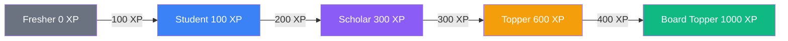
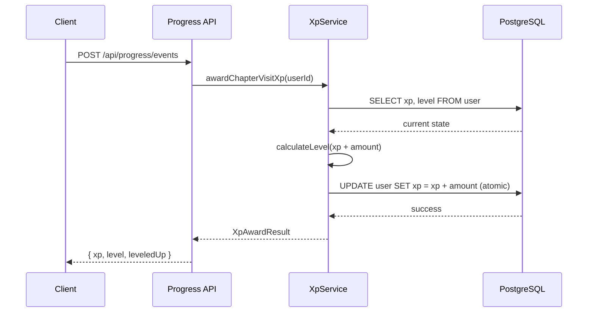

## Overview

The gamification system transforms learning into a rewarding progression loop. Students earn XP for every meaningful action — reading chapters, completing exercises, reviewing flashcards, and passing quizzes. XP feeds into a level system with named tiers, while daily streaks and achievement badges provide long-term motivation.

The system operates in **two layers**: a server-side authority layer (PostgreSQL + Drizzle) for XP and levels, and a client-side mirror layer (localStorage) for real-time UI state.

<CardGroup cols={2}>
  <Card title="XP Earning" icon="star">
    Earn XP for chapter visits, exercises, flashcards, quizzes, and accepted forum answers
  </Card>
  <Card title="Level Progression" icon="trophy">
    5 named tiers from Fresher to Board Topper with increasing thresholds
  </Card>
  <Card title="Streak System" icon="fire">
    Daily activity streaks with a weekly cooldown freeze mechanic
  </Card>
  <Card title="Achievement Badges" icon="medal">
    8 unlockable badges for milestones across subjects and study habits
  </Card>
</CardGroup>

---

## XP Point Values

Every student action maps to a fixed XP reward. The server-side `XpService` defines these constants:

```typescript
// backend/src/services/xp.service.ts
export const XP_VALUES = {
  chapterVisit: 5,
  exerciseView: 2,
  flashcardComplete: 10,
  quizPass: 25,
  forumAnswerAccepted: 15
} as const;
```

<Accordion title="Client-side XP rewards (frontend gamification layer)">
The frontend maintains a parallel set of XP values for the localStorage-based gamification state:

```typescript
// frontend/src/lib/gamification-types.ts
export const XP_REWARDS = {
  SUMMARY_READ: 10,
  EXERCISE_COMPLETE: 15,
  EXERCISE_MEDIUM: 20,
  EXERCISE_HARD: 25,
  EXERCISE_BONUS_ALL: 50,
  FLASHCARD_REVIEW: 5,
  FLASHCARD_KNOWN: 10,
  FLASHCARD_BONUS_ALL: 30,
  QUIZ_COMPLETE: 40,
  QUIZ_HIGH_SCORE: 50,
  QUIZ_PERFECT: 100,
} as const;
```
</Accordion>

---

## Level System

Levels are calculated from cumulative XP. Each threshold defines both a numeric level and a display name tied to Pakistani board exam culture.

```typescript
export const LEVEL_THRESHOLDS = [
  { level: 0, name: "Fresher",       minXp: 0 },
  { level: 1, name: "Student",       minXp: 100 },
  { level: 2, name: "Scholar",       minXp: 300 },
  { level: 3, name: "Topper",        minXp: 600 },
  { level: 4, name: "Board Topper",  minXp: 1000 }
] as const;
```

The `calculateLevel` method iterates through thresholds to find the highest matching level:

```typescript
calculateLevel(xp: number): { level: number; name: LevelName } {
  let currentLevel = 0;
  let levelName: LevelName = "Fresher";

  for (const threshold of LEVEL_THRESHOLDS) {
    if (xp >= threshold.minXp) {
      currentLevel = threshold.level;
      levelName = threshold.name;
    }
  }

  return { level: currentLevel, name: levelName };
}
```

### Level Progression Diagram



---

## XP Award Flow

The `awardXp` method uses **atomic SQL increments** to prevent race conditions when multiple requests update a user's XP simultaneously.

<Steps>
  <Step title="Validate input">
    The XP amount must be a non-negative number. Invalid values throw an error immediately.
  </Step>
  <Step title="Fetch current state">
    Read the user's current XP and level from the database.
  </Step>
  <Step title="Calculate new level">
    Pass `previousXp + xpAmount` through `calculateLevel()` to detect level-ups.
  </Step>
  <Step title="Atomic update">
    Use SQL increment (`xp + amount`) rather than read-then-write to prevent race conditions.
  </Step>
  <Step title="Return result">
    Include awarded XP, new total, level info, and whether the user leveled up.
  </Step>
</Steps>

```typescript
async awardXp(userId: string, xpAmount: number, reason: string): Promise<XpAwardResult> {
  // Atomic increment prevents race conditions
  await db
    .update(users)
    .set({
      xp: sql`${users.xp} + ${xpAmount}`,
      level: newLevel
    })
    .where(eq(users.id, userId));

  return {
    xpAwarded: xpAmount,
    newXp,
    level: newLevel,
    levelName: newLevelName,
    leveledUp,
    previousLevel
  };
}
```

### Data Flow



<Note>
Quiz XP is awarded by the quiz service (not the progress service) to avoid double-awarding when a quiz submission also triggers a progress event.
</Note>

---

## Streak System

Study streaks track consecutive days of activity. The streak resets if a student misses a day, but a **streak freeze** mechanic provides a safety net.

### Streak Freeze

The streak freeze can be used once per 7-day cooldown period to preserve a streak that would otherwise break:

```typescript
const STREAK_FREEZE_COOLDOWN_MS = 7 * 24 * 60 * 60 * 1000; // 7 days

async checkStreakFreeze(userId: string): Promise<StreakFreezeResult> {
  // Check last freeze usage timestamp
  const timeSinceLastUse = now.getTime() - user.streakFreezeUsedAt.getTime();
  const canUse = timeSinceLastUse >= STREAK_FREEZE_COOLDOWN_MS;

  return {
    canUseStreakFreeze: canUse,
    nextFreezeAvailableAt: canUse
      ? null
      : new Date(user.streakFreezeUsedAt.getTime() + STREAK_FREEZE_COOLDOWN_MS)
  };
}
```

<Warning>
Streak freeze state is persisted server-side in the `user` table's `streakFreezeUsedAt` column. The cooldown is enforced at the database level, not just in the UI.
</Warning>

### Client-side Streak Tracking

The frontend also tracks streaks in localStorage for instant UI feedback:

```typescript
// frontend/src/lib/gamification-storage.ts
export function updateStreak(): GamificationState {
  const today = new Date().toISOString().split("T")[0];
  const diffDays = Math.floor((now.getTime() - last.getTime()) / (1000 * 60 * 60 * 24));

  if (diffDays === 0) return state;        // Already active today
  if (diffDays === 1) return increment();   // Consecutive day
  return reset();                            // Streak broken
}
```

---

## Achievement Badges

Eight badges reward specific milestones. Badges are defined as a typed registry on the frontend:

```typescript
export const BADGE_DEFINITIONS: Record<BadgeId, BadgeDefinition> = {
  first_steps:     { icon: "🚀", criteria: "Complete first chapter" },
  scholar:         { icon: "📚", criteria: "Read all chapter summaries" },
  problem_solver:  { icon: "🧩", criteria: "Solve 50 exercises" },
  memory_master:   { icon: "🧠", criteria: "Mark 100 flashcards as known" },
  quiz_champion:   { icon: "🏆", criteria: "Perfect score on 5 quizzes" },
  streak_starter:  { icon: "🔥", criteria: "7 day study streak" },
  streak_warrior:  { icon: "💪", criteria: "30 day study streak" },
  subject_master:  { icon: "⭐", criteria: "Complete all chapters in subject" },
};
```

| Badge | Requirement | Category |
|-------|-------------|----------|
| First Steps | Complete first chapter | Onboarding |
| Scholar | Read all summaries in a subject | Content |
| Problem Solver | Complete 50 exercises | Practice |
| Memory Master | Know 100 flashcards | Flashcards |
| Quiz Champion | Score 100% on 5 quizzes | Quizzes |
| Streak Starter | 7-day streak | Consistency |
| Streak Warrior | 30-day streak | Consistency |
| Subject Master | Complete all chapters in a subject | Mastery |

---

## Shareable Result Cards

After completing a quiz, students can generate a shareable image card using `html-to-image`. The `shareable-result-card.tsx` component renders a styled card with:

- Student name and subject
- Score percentage with a visual progress ring
- Level badge and XP earned
- Branded LearningoPK styling

<Tip>
Shareable cards are rendered as DOM elements and converted to PNG using `html-to-image`. The card uses the platform's design system colors for consistent branding across shared images.
</Tip>

---

## Gamification State Types

The complete frontend state schema:

```typescript
export interface GamificationState {
  xp: number;
  totalXp: number;
  level: number;
  currentStreak: number;
  longestStreak: number;
  lastActivityDate: string | null;
  unlockedBadges: BadgeId[];
  chapterProgress: Record<string, ChapterProgress>;
}

export interface ChapterProgress {
  summaryRead: boolean;
  exercisesCompleted: number[];
  flashcardsReviewed: Record<string, CardStatus>;
  quizAttempts: QuizAttempt[];
}

export type CardStatus = "new" | "learning" | "known" | "review";
```

<Note>
The client-side gamification state uses `localStorage` keyed under `"learningopk-gamification"`. It is SSR-safe — all storage functions check `typeof window === "undefined"` before accessing localStorage.
</Note>
