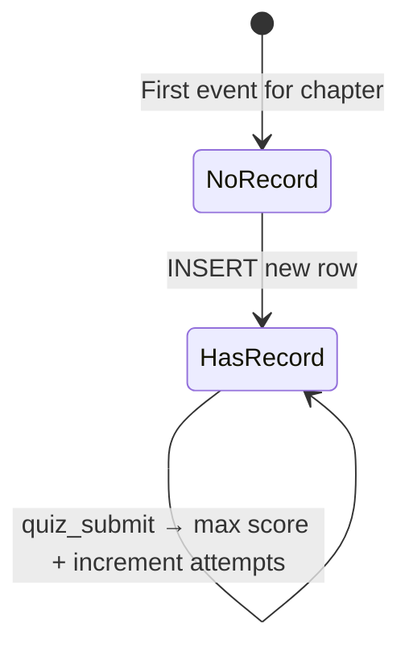
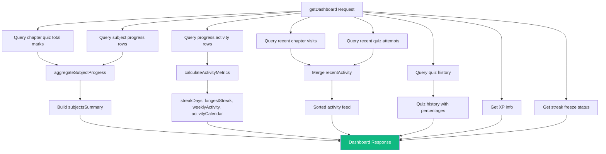
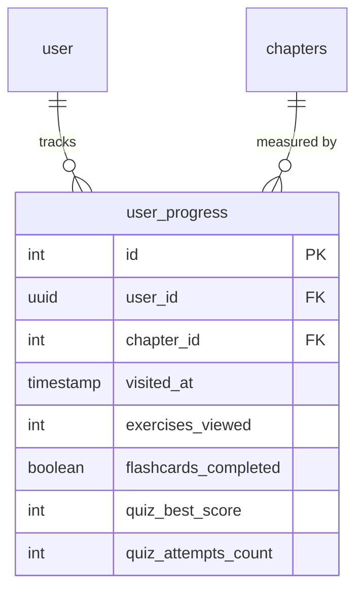

## Overview

The progress system records every student interaction — chapter visits, exercise views, flashcard completions, quiz submissions — and aggregates them into dashboards that show learning trajectory across subjects. It uses an **event-sourced** pattern where discrete events are applied to a persistent snapshot, then aggregated for display.

The architecture separates event recording (`progress.ts`), business logic (`progress.service.ts`), metrics computation (`progress-metrics.ts`), and data access (`progress.repository.ts`).

<CardGroup cols={2}>
  <Card title="Event Recording" icon="bolt">
    4 event types applied to per-chapter snapshots
  </Card>
  <Card title="Dashboard Aggregation" icon="chart-line">
    Subject-level and chapter-level progress summaries
  </Card>
  <Card title="Streak Calculation" icon="fire">
    Current and longest streak from activity date sets
  </Card>
  <Card title="Activity Calendar" icon="calendar">
    365-day heatmap with 5 intensity levels
  </Card>
</CardGroup>

---

## Event Types

Progress is recorded as discrete events. Each event type modifies specific fields on the `user_progress` snapshot.

```typescript
// packages/shared/src/types/progress.ts
export const progressEventSchema = z.discriminatedUnion("eventType", [
  z.object({ eventType: z.literal("chapter_visit"),     chapterId: z.number().int().positive() }),
  z.object({ eventType: z.literal("exercise_view"),      chapterId: z.number().int().positive() }),
  z.object({ eventType: z.literal("flashcard_complete"), chapterId: z.number().int().positive() }),
  z.object({ eventType: z.literal("quiz_submit"),        chapterId: z.number().int().positive(), score: z.number().int().nonnegative() }),
]);
```

### Event-to-Snapshot Mapping

| Event Type | Fields Updated | Behavior |
|------------|---------------|----------|
| `chapter_visit` | `visitedAt` | Overwrites with latest timestamp |
| `exercise_view` | `visitedAt`, `exercisesViewed` | Increments counter |
| `flashcard_complete` | `visitedAt`, `flashcardsCompleted` | Sets boolean to `true` |
| `quiz_submit` | `visitedAt`, `quizBestScore`, `quizAttemptsCount` | Takes max score, increments attempts |

---

## Progress Event Application

The `applyProgressEvent` function in `backend/src/lib/progress.ts` handles both creation and update of progress snapshots.

### State Machine



### Upsert Logic

```typescript
export const applyProgressEvent = async (input: ProgressEventInput): Promise<ProgressSnapshot> => {
  // Check if progress record exists
  const existing = await db.select().from(userProgress)
    .where(and(eq(userProgress.userId, input.userId), eq(userProgress.chapterId, input.chapterId)));

  if (!existing) {
    // INSERT — set initial values based on event type
    return await db.insert(userProgress).values({
      userId: input.userId,
      chapterId: input.chapterId,
      visitedAt: occurredAt,
      exercisesViewed: input.eventType === "exercise_view" ? 1 : 0,
      flashcardsCompleted: input.eventType === "flashcard_complete",
      quizBestScore: input.eventType === "quiz_submit" ? input.score : 0,
      quizAttemptsCount: input.eventType === "quiz_submit" ? 1 : 0
    }).returning();
  }

  // UPDATE — apply event-specific mutation
  if (input.eventType === "exercise_view") {
    await db.update(userProgress).set({
      exercisesViewed: existing.exercisesViewed + 1
    });
  } else if (input.eventType === "quiz_submit") {
    await db.update(userProgress).set({
      quizBestScore: Math.max(existing.quizBestScore, input.score),
      quizAttemptsCount: existing.quizAttemptsCount + 1
    });
  }
  // ... other event types
};
```

<Note>
Quiz best score uses `Math.max(existing, new)` to ensure the stored score is always the highest achieved. Attempt count always increments regardless of score.
</Note>

---

## XP Integration

Each progress event (except `quiz_submit`) triggers an XP award through `XpService`. Quiz XP is handled separately by the quiz service to avoid double-awarding.

```typescript
// backend/src/services/progress.service.ts
async recordProgressEvent(input: ProgressEventInput): Promise<ProgressEventResult> {
  // 1. Apply progress event to snapshot
  const snapshot = await applyProgressEvent(input);

  // 2. Award XP based on event type
  if (input.eventType === "chapter_visit") {
    xpResult = await xpService.awardChapterVisitXp(input.userId);       // 5 XP
  } else if (input.eventType === "exercise_view") {
    xpResult = await xpService.awardExerciseViewXp(input.userId);       // 2 XP
  } else if (input.eventType === "flashcard_complete") {
    xpResult = await xpService.awardFlashcardCompleteXp(input.userId);  // 10 XP
  }
  // quiz_submit XP awarded by quiz.service.ts

  return { eventType, progress: snapshot, xp: xpResult };
}
```

---

## Dashboard Aggregation

The main dashboard combines data from multiple repository queries into a single response.

### Dashboard Data Flow



### Subject Aggregation

The `aggregateSubjectProgress` method groups chapter-level rows into subject-level summaries:

```typescript
private aggregateSubjectProgress(rows, chapterTotalMarks): Map<number, SubjectAggregate> {
  for (const row of rows) {
    const quizPercent = scoreToPercent(quizBestScore, totalMarks);

    if (!existing) {
      aggregates.set(row.subjectId, {
        totalChapters: 1,
        visitedChapters: visitedAt ? 1 : 0,
        bestQuizScorePercent: quizPercent,
      });
    } else {
      existing.totalChapters += 1;
      if (visitedAt) existing.visitedChapters += 1;
      if (quizPercent > existing.bestQuizScorePercent) {
        existing.bestQuizScorePercent = quizPercent;
      }
    }
  }
}
```

---

## Subject Dashboard

The subject-level drill-down shows per-chapter status with color-coded indicators:

```typescript
async getSubjectDashboard(userId, boardSlug, grade, subjectSlug) {
  const chapterProgress = chapterRows.map((chapter) => {
    const bestScorePercent = scoreToPercent(chapter.quizBestScore, totalMarks);
    const status = quizAttempted
      ? (bestScorePercent > 70 ? "green" : "yellow")
      : "grey";

    return {
      chapterId, chapterNumber, chapterTitle, chapterSlug,
      visited: Boolean(chapter.visitedAt),
      exercisesViewed: chapter.exercisesViewed ?? 0,
      quizAttempted,
      bestScorePercent,
      status
    };
  });

  const overallSubjectScorePercent = Math.round(
    chapterProgress.reduce((sum, ch) => sum + ch.bestScorePercent, 0) / chapterProgress.length
  );
}
```

### Chapter Status Colors

| Status | Condition | Meaning |
|--------|-----------|---------|
| `green` | Quiz attempted AND score > 70% | Mastered |
| `yellow` | Quiz attempted AND score <= 70% | Needs review |
| `grey` | Quiz not attempted | Not yet assessed |

---

## Streak Calculation

Streaks are computed from a set of unique activity date keys, not from a stored counter. This makes the calculation immune to data inconsistencies.

### Current Streak

```typescript
export const calculateStreakDays = (activityDates: Date[], referenceDate: Date): number => {
  const activityDateKeys = new Set(activityDates.map((date) => toDateKey(date)));
  let streakDays = 0;
  let cursor = referenceUtcDay;

  while (activityDateKeys.has(toDateKey(cursor))) {
    streakDays += 1;
    cursor = shiftUtcDays(cursor, -1);  // Walk backwards day by day
  }

  return streakDays;
};
```

### Longest Streak

```typescript
export const calculateLongestStreakDays = (activityDates: Date[]): number => {
  const sortedKeys = [...activityDateKeys].sort();

  let longest = 0;
  let current = 0;

  for (const key of sortedKeys) {
    const day = new Date(`${key}T00:00:00.000Z`);
    if (!previousDay || day.getTime() === shiftUtcDays(previousDay, 1).getTime()) {
      current += 1;   // Consecutive day
    } else {
      current = 1;     // Gap detected, reset
    }
    longest = Math.max(longest, current);
  }

  return longest;
};
```

<Warning>
All date operations use UTC day boundaries (`createUtcDay`) to avoid timezone-related streak calculation errors. The `toDateKey` function outputs ISO date strings like `"2026-03-30"` in UTC.
</Warning>

---

## Activity Calendar

The activity calendar generates a 365-day heatmap with 5 intensity levels, similar to GitHub's contribution graph.

### Activity Level Calculation

```typescript
type ActivityLevel = 0 | 1 | 2 | 3 | 4;

const toActivityLevel = (count: number, maxCount: number): ActivityLevel => {
  if (count <= 0 || maxCount <= 0) return 0;

  const ratio = count / maxCount;
  return Math.min(4, Math.max(1, Math.ceil(ratio * 4))) as ActivityLevel;
};
```

| Level | Intensity | Visual |
|-------|-----------|--------|
| 0 | No activity | Empty cell |
| 1 | Low (1-25% of max) | Light fill |
| 2 | Medium (26-50%) | Medium fill |
| 3 | High (51-75%) | Strong fill |
| 4 | Very high (76-100%) | Full fill |

### Daily Activity Count

Each day's activity count is the sum of events for that day:

```typescript
const count = 1 + row.exercisesViewed + row.quizAttemptsCount;
activityDailyCounts.set(key, (activityDailyCounts.get(key) ?? 0) + count);
```

---

## Score Calculation

The `scoreToPercent` utility normalizes all scores to a 0-100 range with clamping:

```typescript
export const scoreToPercent = (score: number, totalMarks: number): number => {
  if (totalMarks <= 0) return 0;
  return Math.min(100, Math.max(0, Math.round((score / totalMarks) * 100)));
};
```

This is used consistently across the dashboard for quiz percentages and subject score summaries.

---

## Database Schema

The `user_progress` table stores one row per user per chapter:



<Tip>
The `user_progress` table uses a composite unique constraint on `(user_id, chapter_id)` to ensure one snapshot per chapter per student. The application-level upsert logic (check existing, then insert or update) enforces this at the query level.
</Tip>

---

## API Endpoints

| Method | Endpoint | Description |
|--------|----------|-------------|
| `POST` | `/api/progress/events` | Record a progress event |
| `GET` | `/api/progress/dashboard` | Main dashboard with all metrics |
| `GET` | `/api/progress/dashboard/:boardSlug/:grade/:subjectSlug` | Subject-specific dashboard |
